# RozgarSetu Project Flowcharts & Architecture

This document summarizes the full RozgarSetu platform architecture, database schema, and major feature flows.

## 1. System Architecture

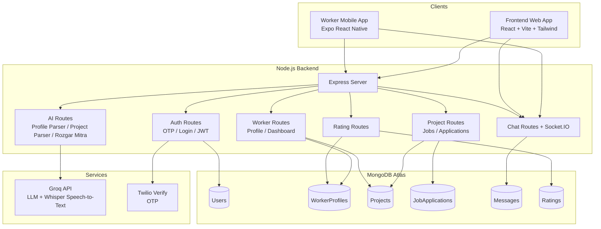

## 2. Database Schema Design

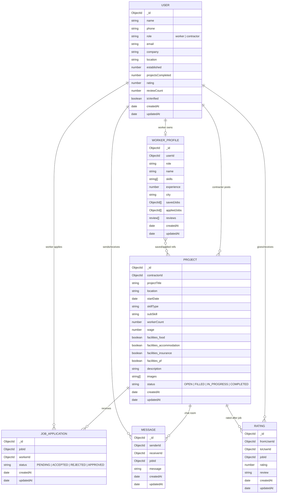

## 3. User Roles And Main Features

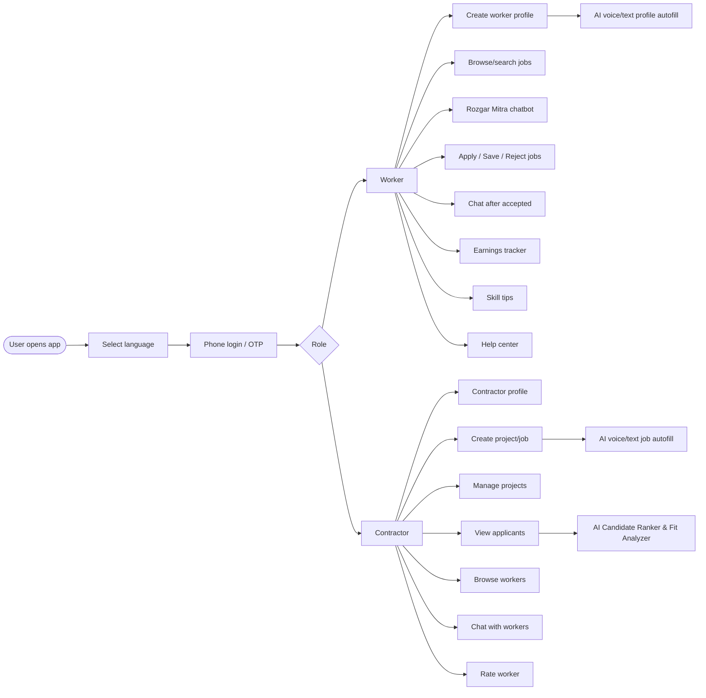

## 4. Worker Job Discovery Flow

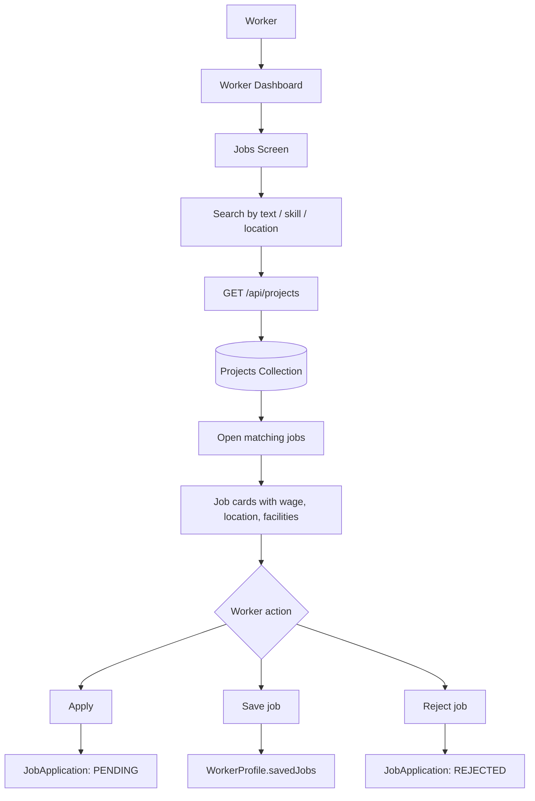

## 5. Contractor Project Creation Flow

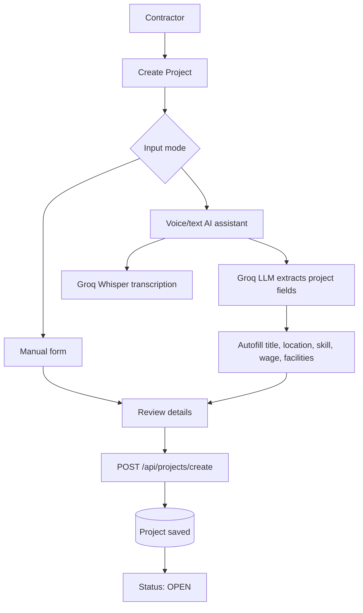

## 6. Worker AI Profile Autofill Flow

```mermaid
sequenceDiagram
  participant Worker
  participant App as WorkerApp/Profile UI
  participant API as /api/ai/parse-profile
  participant Groq as Groq AI
  participant Form as Profile Form

  Worker->>App: Speaks/types profile details
  App->>API: Submit text or audio
  API->>Groq: Transcribe audio if needed
  API->>Groq: Extract name/city/skills/experience
  Groq-->>API: Structured JSON
  API-->>App: profile JSON
  App->>Form: Autofill profile fields
```

## 7. Rozgar Mitra RAG Chatbot Flow

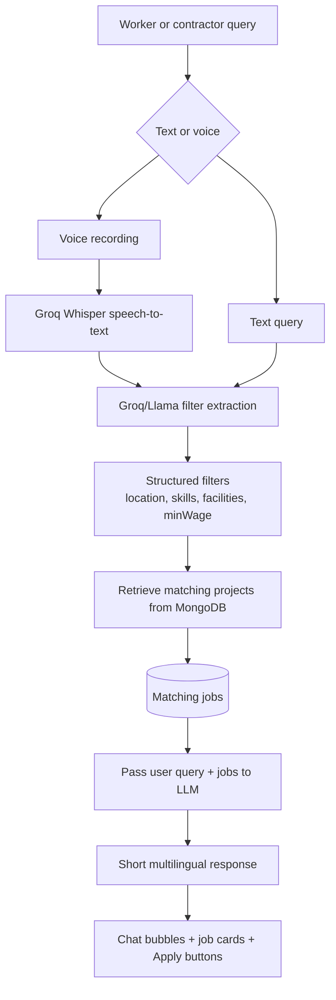

Example query:

```text
मुझे गाजियाबाद में पेंटर का काम चाहिए जिसमें भोजन भी मिले
```

Extracted filters:

```json
{
  "location": "Ghaziabad",
  "skills": ["painter"],
  "facilities": {
    "food": true
  }
}
```

## 8. Candidate Ranker & Fit Analyzer Flow

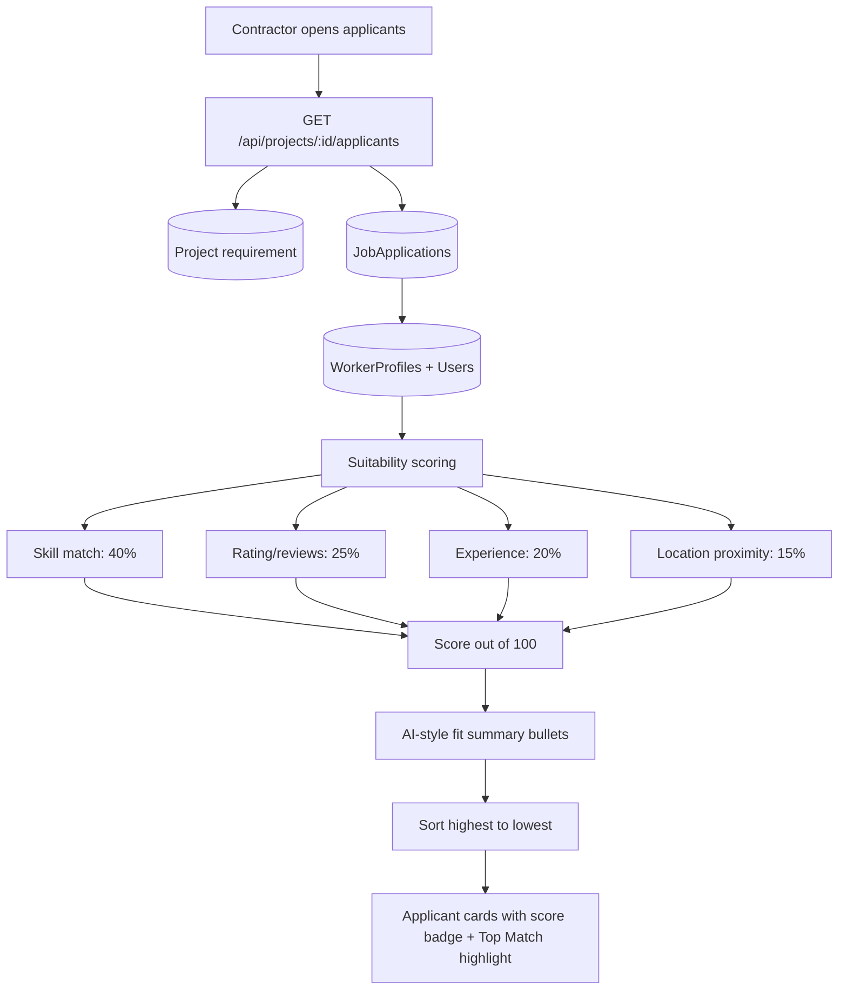

## 9. Real-Time Chat Flow

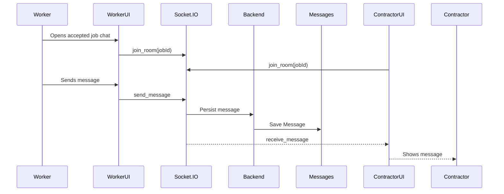

## 10. Rating And Review Flow

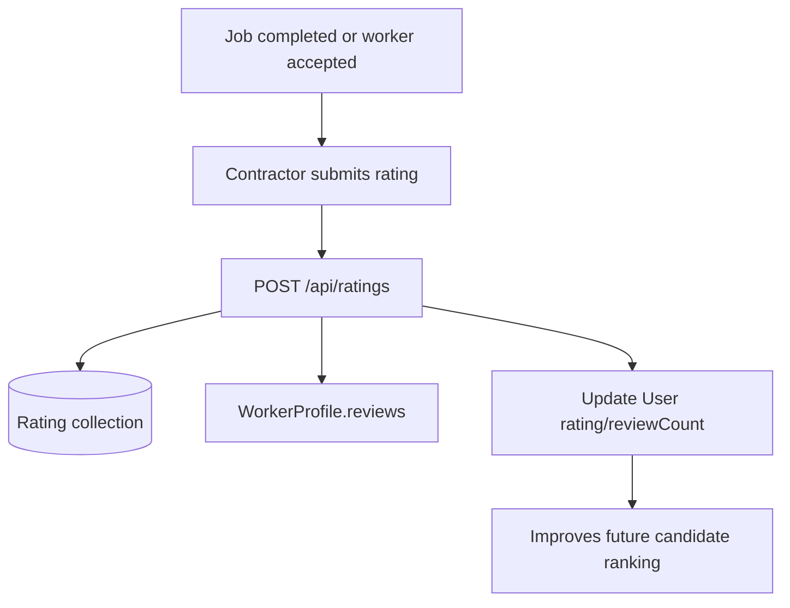

## 11. API Surface Summary

```mermaid
flowchart LR
  API[Express API] --> Auth[/api/auth]
  API --> Projects[/api/projects]
  API --> Worker[/api/worker]
  API --> Chat[/api/chat]
  API --> Ratings[/api/ratings]
  API --> AI[/api/ai]

  AI --> ProfileAI[parse-profile-text/audio]
  AI --> ProjectAI[parse-project-text/audio]
  AI --> Mitra[rozgar-mitra]

  Projects --> Create[create]
  Projects --> Search[list/search]
  Projects --> Apply[apply/reject]
  Projects --> Applicants[applicants + ranker]
  Projects --> Status[status updates]
```

## 12. Feature Summary

| Area | Feature | Main Files |
| --- | --- | --- |
| Auth | Phone OTP login, JWT auth, role selection | `authRoutes`, `authController`, `authMiddleware` |
| Worker Profile | Manual profile + AI voice/text autofill | `ProfileSetupScreen`, `WorkerProfile.tsx`, `aiController` |
| Job Search | Search by skill/location/text, save/apply/reject jobs | `JobsScreen`, `JobListing`, `projectController` |
| Contractor Projects | Create/manage jobs with images, facilities, wage | `CreateProject`, `ContractorProjects`, `Project` model |
| AI Job Autofill | Contractor speaks job requirement and form auto-fills | `CreateProject`, `parse-project-audio/text` |
| Rozgar Mitra | Multilingual RAG chatbot for job discovery | `aiChatController`, `RozgarMitraScreen`, `RozgarMitra.tsx` |
| Candidate Ranker | Suitability score, top match, AI fit bullets | `projectController`, `ContractorProjectApplicants` |
| Chat | Real-time worker/contractor messaging | `ChatScreen`, `chatRoutes`, `Message`, Socket.IO |
| Ratings | Contractor reviews worker, improves ranking | `ratingRoutes`, `Rating`, `WorkerProfile.reviews` |
| Worker Support | Earnings, skill tips, help center | `EarningsScreen`, `SkillTipsScreen`, `HelpScreen` |

## 13. Deployment-Level View

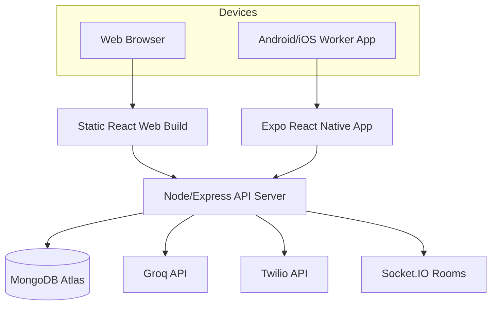

## Notes For Future Improvements

- Add latitude/longitude to `Project` and `WorkerProfile` for real distance calculation.
- Persist Rozgar Mitra chat history if long-term assistant memory is needed.
- Move AI helper logic into `/services/aiService.js` as the AI surface grows.
- Add indexes on `Project.location`, `Project.skillType`, `Project.status`, `JobApplication.jobId`, and `WorkerProfile.skills`.
- Add audit logs for AI-generated autofill and candidate ranking decisions.
